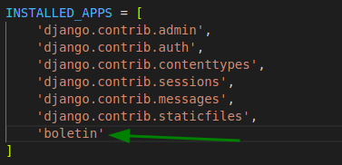
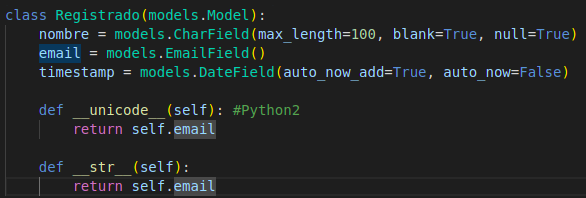
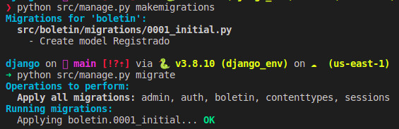

# DJANGO

## Crear entorno virtual

<em>$ virtualenv django_env</em>

<em>$ source django_env/bin/activate</em>

## Levantar Django

<em>$python django_env/bin/django-admin startproject test_project</em>

## Git

<em>git push git@github.com:german001101/django.git main<em>

<em>git pull git@github.com:german001101/django.git main<em>

## Django

pip install Django==4.0.6

### Verificar que se tiene instalado

$ pip freeze

* asgiref==3.5.2
* backports.zoneinfo==0.2.1
* Django==4.0.6
* sqlparse==0.4.2
  
### Levantar Django

> python manage.py runserver

### Migration(Base de datos y el proyecto)

> python manage.py migrate

### Crear superUsuario

* python src/manage.py createsuperuser
* Username (leave blank to use 'gburgos'): 
* Email address: german001101@gmail.ocm
* Password: 
* Password (again): 
* Superuser created successfully.

### Levantar una app con django

* python manage.py startapp boletin

### Registro de la app

* Ir a settings.py > INSTALLED_APPS

### Escribir Modelos

boletin > models.py\

### Migrar

* python manage.py makemigrations
* python manage.py migrate

